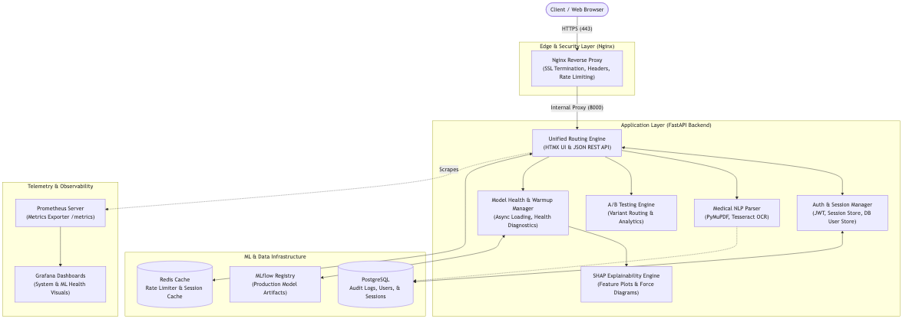
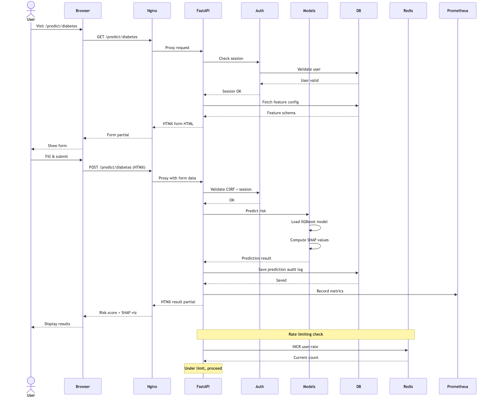
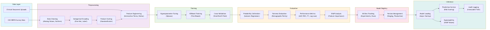
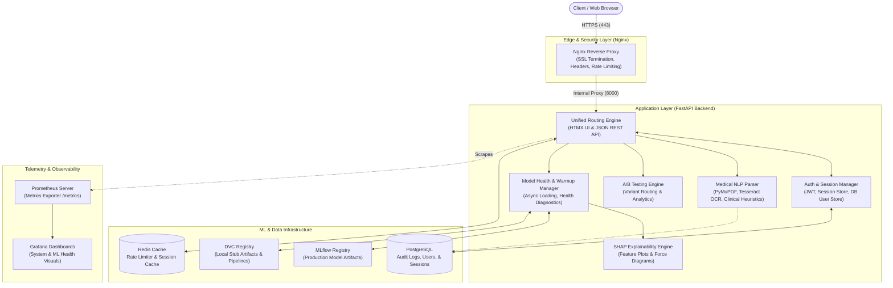
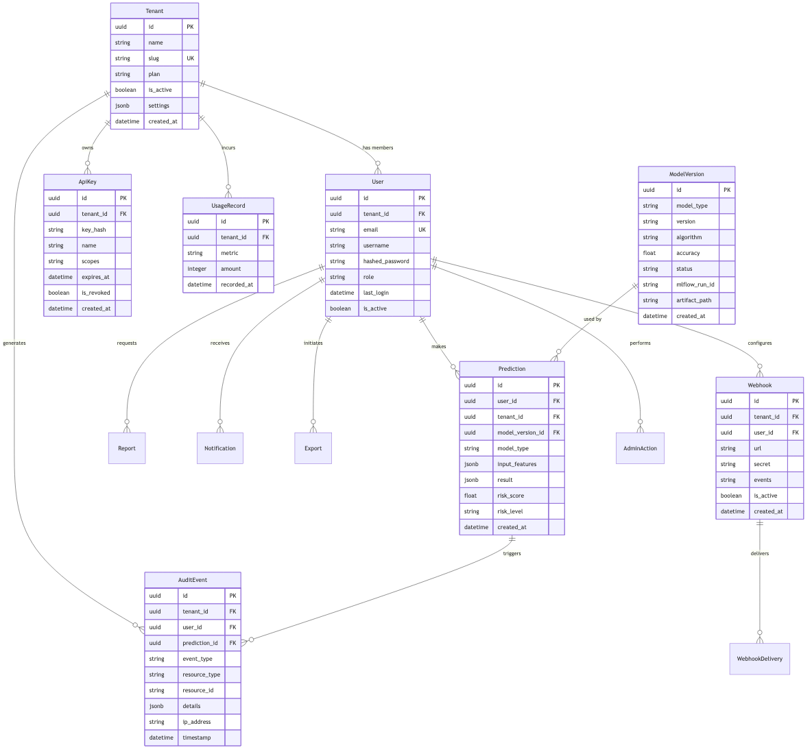
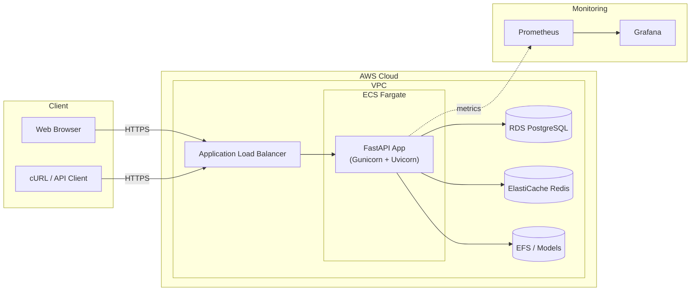

<p align="center">
  
</p>

<h1 align="center">HealthPredict AI</h1>

<p align="center">
  <em>End-to-End Healthcare Risk Prediction Platform</em>
</p>

<p align="center">
  <a href="#"></a>
  <a href="#"></a>
  <a href="LICENSE"></a>
  <a href="#"></a>
  <a href="#"></a>
  <a href="#"></a>
  <a href="https://github.com/theogengineer/Healthcare-Risk-Prediction/releases"></a>
  <a href="CODE_OF_CONDUCT.md"></a>
</p>

---

Predict patient risks for **Diabetes**, **Heart Disease**, and **Lung Cancer** using clinical indicators. This platform combines a FastAPI + HTMX web interface, versioned REST APIs, clinical NLP document ingestion, XGBoost models, SHAP explainability, fairness calibration, and full MLOps observability.

---

## Screenshots

<p align="center">
  <i>Demo GIF (coming soon)</i>
</p>

<p align="center">
  
  <br/><em>System Architecture</em>
</p>

<p align="center">
  
  <br/><em>Request Lifecycle Sequence</em>
</p>

<p align="center">
  
  <br/><em>ML Training & Inference Pipeline</em>
</p>

---

## Table of Contents

- [Architecture](#architecture)
- [ER Diagram](#er-diagram)
- [Deployment Architecture](#deployment-architecture)
- [Project Tree](#project-tree)
- [Features](#features)
- [Technology Stack](#technology-stack)
- [Installation](#installation)
- [Docker](#docker)
- [Kubernetes](#kubernetes)
- [API Reference](#api-reference)
- [Authentication](#authentication)
- [ML Pipeline](#ml-pipeline)
- [MLOps](#mlops)
- [Monitoring](#monitoring)
- [Testing](#testing)
- [Contributing](#contributing)
- [License](#license)

---

## Architecture



---

## ER Diagram

The database schema spans 14 models across tenants, users, predictions, audits, exports, webhooks, and ML model versions.

<p align="center">
  
  <br/><em>Entity-Relationship Diagram</em>
</p>

See [docs/architecture/er_diagram.md](docs/architecture/er_diagram.md) for the textual schema reference.

Key entities:
- **Tenant** — Multi-tenant isolation for organizations
- **User** — Authentication, roles, memberships
- **Prediction** — Model inference input/output audit trail
- **AuditEvent** — Immutable security and compliance log
- **ApiKey** — Scoped API key authentication
- **Webhook** — Event-driven integration callbacks
- **ModelVersion** — ML model registry version tracking
- **Export** — Data export request records
- **UsageRecord** — Per-tenant usage metering

---

## Deployment Architecture



Alternative deployments: Render single-container, Docker Compose, or Kubernetes (Helm).

---

## Project Tree

```
Healthcare-Risk-Prediction/
├── .github/
├── backend/
├── frontend/
├── deployment/
├── docs/
├── monitoring/
├── config/
├── scripts/
├── shared/
├── tests/
├── data/
├── ml/
│
├── README.md
├── LICENSE
├── CONTRIBUTING.md
├── CODE_OF_CONDUCT.md
├── SECURITY.md
├── CHANGELOG.md
├── CITATION.cff
│
├── Dockerfile
├── docker-compose.yml
│
├── pyproject.toml
├── requirements.txt
├── requirements-dev.txt
├── Makefile
│
├── .gitignore
├── .gitattributes
```

---

## Features

### 1. Advanced Machine Learning
- **Multi-Model Predictions:** XGBoost classifiers for Diabetes, Heart Disease, Lung Cancer
- **SHAP Explainability:** Real-time feature importance visualizations for clinicians
- **Calibration & Fairness:** Isotonic regression calibration, demographic parity evaluation
- **Model Lifecycle:** Async warmup, health diagnostics, stage transitions

### 2. Clinical NLP Document Ingestion
- **PDF & Image Parsing:** PyMuPDF, Pillow, Tesseract OCR
- **Entity Extraction:** BMI, blood pressure, smoker status, age from free-text reports
- **Auto-Population:** Extracted values pre-fill risk evaluation forms

### 3. Full-Stack Web App
- **HTMX Frontend:** Dynamic partial page updates, no JS framework needed
- **A/B Testing:** Variant routing for UI experiments
- **Responsive Design:** Mobile-friendly dashboard

### 4. Enterprise Security
- **Multi-Auth:** JWT cookies, API keys (X-API-Key), session management
- **Defenses:** CSRF tokens, CORS, trusted hosts, Redis rate-limiting
- **Multi-Tenancy:** Tenant-isolated data access

### 5. Observability
- **Prometheus Metrics:** Request latencies, error rates, model health
- **Grafana Dashboards:** System resources + ML throughput visualizations

---

## Technology Stack

| Component | Technologies |
|-----------|-------------|
| **Backend** | FastAPI, Pydantic v2, SQLAlchemy 2.0 (async), Alembic |
| **Machine Learning** | XGBoost, Scikit-Learn, SHAP, Pandas, NumPy, Joblib |
| **MLOps** | MLflow, DVC |
| **Frontend** | HTMX, Jinja2, Alpine.js, CSS |
| **Database** | PostgreSQL 15, Redis 7 |
| **Infrastructure** | Docker, Nginx, Kubernetes (Helm), Terraform |
| **Security** | Redis (rate-limit), PyJWT, Bandit, pip-audit |
| **Monitoring** | Prometheus, Grafana |

---

## Installation

### Prerequisites
- Python 3.11+
- Docker & Docker Compose
- Tesseract OCR (`brew install tesseract` / `apt-get install tesseract-ocr`)

### Quick Start

```bash
# Clone
git clone https://github.com/theogengineer/Healthcare-Risk-Prediction.git
cd Healthcare-Risk-Prediction

# Setup environment
python -m venv .venv && source .venv/bin/activate
pip install -r backend/requirements-dev.txt

# Configure
cp .env.example .env

# Start infrastructure
make docker-dev

# Run migrations
make db-migrate

# Start dev server
make dev
```

Open [http://localhost:8000](http://localhost:8000).

---

## Docker

### Development (app runs locally, only DB + Redis in containers)

```bash
docker compose -f deployment/docker/docker-compose.dev.yml up -d
```

### Production (full stack)

```bash
docker compose -f deployment/docker/docker-compose.yml up -d --build
```

Services: FastAPI (Gunicorn), PostgreSQL, Redis, Nginx, MLflow, Prometheus, Grafana.

```bash
# With monitoring stack
docker compose -f deployment/docker/docker-compose.yml --profile monitoring up -d
```

---

## Kubernetes

Deploy via Helm chart:

```bash
helm lint deployment/kubernetes/healthpredict

helm upgrade --install healthpredict deployment/kubernetes/healthpredict \
  --namespace production --create-namespace \
  -f deployment/kubernetes/healthpredict/values.yaml
```

The chart includes Deployment, HPA, Service, Ingress, ConfigMap, Secret, and PVC templates.

---

## API Reference

### Authentication

| Method | Header | Description |
|--------|--------|-------------|
| `X-API-Key` | Header | API key-based auth for all `/api/v1/` endpoints |
| `Authorization: Bearer <jwt>` | Header | JWT-based auth for web sessions |
| Session cookie | Cookie | Encrypted cookie for HTMX browser sessions |

> **Dev:** Set `DEV_API_KEY` in `.env` and use it as `X-API-Key` header.

### Endpoints

| Method | Endpoint | Auth | Description |
|--------|----------|------|-------------|
| `GET` | `/healthz` | Public | Liveness check |
| `GET` | `/api/v1/health/ready` | Public | Readiness (DB + models) |
| `GET` | `/metrics` | Public | Prometheus metrics |
| `POST` | `/api/v1/predict/diabetes` | API Key | Diabetes risk prediction |
| `POST` | `/api/v1/predict/heart` | API Key | Heart disease risk prediction |
| `POST` | `/api/v1/predict/lung` | API Key | Lung cancer risk prediction |
| `POST` | `/api/v1/upload` | API Key | Upload clinical document |
| `GET` | `/api/v1/models` | API Key | Model registry listing |
| `GET` | `/api/v1/audit` | API Key | Audit event log |
| `GET` | `/api/v1/users/me` | Session | Current user profile |
| `POST` | `/auth/register` | Public | User registration |
| `POST` | `/auth/login` | Public | User login |

### Example

```bash
curl -X POST http://localhost:8000/api/v1/predict/diabetes \
  -H "Content-Type: application/json" \
  -H "X-API-Key: your-dev-api-key" \
  -d '{"age": 45, "bmi": 28.4, "bp": 1, "cholesterol": 1, "smoker": 0, "activity": 1, "health": 3, "mental": 2}'
```

Interactive docs at [http://localhost:8000/docs](http://localhost:8000/docs).

---

## Authentication

The platform supports three authentication modes:

### 1. API Key Auth
Used by external services and CLI tools. Pass `X-API-Key` header. Keys are scoped to specific endpoints and tenant-isolated.

### 2. JWT Session Auth
Used by the web UI. Users register/login via `/auth/register` and `/auth/login`. Sessions are managed via encrypted cookies.

### 3. Multi-Tenancy
Every resource is scoped to a tenant. Users belong to tenants via membership records. API keys and audit logs are tenant-isolated.

---

## ML Pipeline

```mermaid
flowchart LR
    Data["BRFSS Survey Data"] --> Preprocess["Preprocessing"]
    Preprocess --> FeatureEng["Feature Engineering"]
    FeatureEng --> Train["XGBoost Training"]
    Train --> Calibrate["Probability Calibration\n(Isotonic Regression)"]
    Calibrate --> Fairness["Fairness Evaluation"]
    Fairness --> Registry["MLflow Registry"]
    Registry --> Inference["Prediction API"]
    Inference --> Explain["SHAP Explainability"]
```



- **Data Source:** CDC BRFSS survey data
- **Feature Engineering:** One-hot encoding, scaling, interaction terms
- **Training:** XGBoost with hyperparameter optimization (Optuna)
- **Calibration:** Isotonic regression for well-calibrated probabilities
- **Fairness:** Demographic parity evaluation across groups
- **Explainability:** SHAP values with force plots and summary plots
- **Models:** Diabetes (v1), Heart Disease (v1), Lung Cancer (v1, calibrated)

---

## MLOps

| Component | Tool | Purpose |
|-----------|------|---------|
| **Experiment Tracking** | MLflow | Parameter tuning, metric logging |
| **Model Registry** | MLflow + local | Versioning, staging, production promotion |
| **Data Versioning** | DVC | Pipeline reproducibility, artifact tracking |
| **Pipeline Automation** | DVC repro | Reproducible training pipelines |
| **Model Serving** | In-process (Joblib) | Async model loading with health checks |
| **Monitoring** | Prometheus + Grafana | Prediction latency, drift detection, error rates |

### MLflow Server

```bash
# Start local MLflow
mlflow ui --host 127.0.0.1 --port 5000

# Register local models
python ml/scripts/migrate_to_mlflow.py
```

---

## Monitoring

| Stack | Component | Port |
|-------|-----------|------|
| **Prometheus** | Metrics collection, alerting | 9090 |
| **Grafana** | Dashboards, visualization | 3000 |

```bash
# Enable monitoring profile
docker compose -f deployment/docker/docker-compose.yml --profile monitoring up -d
```

Pre-configured dashboards:
- System resources (CPU, memory, requests)
- Model prediction throughput and latency
- Error rates and health check status
- Database connection pool usage

---

## Testing

```bash
# Full suite
make test                    # 659 tests, SQLite (no external deps)

# With coverage
make coverage                # 76% coverage, HTML report in htmlcov/

# Linting
make lint                    # black + isort + flake8

# Security
make security                # bandit SAST + pip-audit
```

Test structure:
- `tests/unit/` — Isolated service/component tests
- `tests/integration/` — API endpoint and DB integration tests
- `tests/e2e/` — Locust load tests

---

## Contributing

Please read [CONTRIBUTING.md](CONTRIBUTING.md) for details on:
- Development setup
- Branch naming (`feat/`, `fix/`, `docs/`, etc.)
- Conventional Commits
- PR process
- Coding standards (black, isort, flake8, mypy)
- Testing requirements

---

## License

Distributed under the MIT License. See [LICENSE](LICENSE) for more information.

---

## Citation

If you use this project in your research, please cite:

```bibtex
@software{healthpredict2026,
  author = {{Your Name}},
  title = {{HealthPredict AI}: End-to-End Healthcare Risk Prediction Platform},
  version = {3.0.0},
  year = {2026},
  url = {https://github.com/theogengineer/Healthcare-Risk-Prediction}
}
```

See [CITATION.cff](CITATION.cff) for the standard citation metadata.
