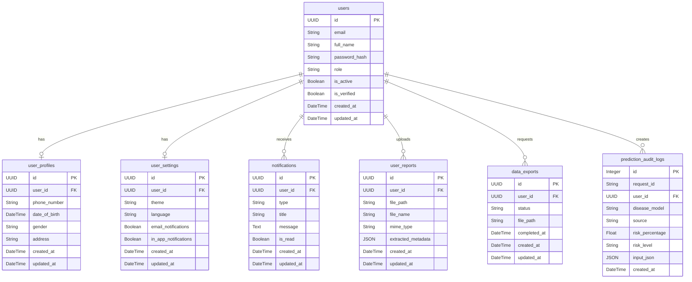

# Phase 2 Database ER Diagram

```mermaid
erDiagram
    users {
        UUID id PK
        String email
        String full_name
        String password_hash
        String role
        Boolean is_active
        Boolean is_verified
        DateTime created_at
        DateTime updated_at
    }

    user_profiles {
        UUID id PK
        UUID user_id FK
        String phone_number
        DateTime date_of_birth
        String gender
        String address
        DateTime created_at
        DateTime updated_at
    }

    user_settings {
        UUID id PK
        UUID user_id FK
        String theme
        String language
        Boolean email_notifications
        Boolean in_app_notifications
        DateTime created_at
        DateTime updated_at
    }

    notifications {
        UUID id PK
        UUID user_id FK
        String type
        String title
        Text message
        Boolean is_read
        DateTime created_at
        DateTime updated_at
    }

    user_reports {
        UUID id PK
        UUID user_id FK
        String file_path
        String file_name
        String mime_type
        JSON extracted_metadata
        DateTime created_at
        DateTime updated_at
    }

    data_exports {
        UUID id PK
        UUID user_id FK
        String status
        String file_path
        DateTime completed_at
        DateTime created_at
        DateTime updated_at
    }
    
    prediction_audit_logs {
        Integer id PK
        String request_id
        UUID user_id FK
        String disease_model
        String source
        Float risk_percentage
        String risk_level
        JSON input_json
        DateTime created_at
    }

    users ||--o| user_profiles : "has"
    users ||--o| user_settings : "has"
    users ||--o{ notifications : "receives"
    users ||--o{ user_reports : "uploads"
    users ||--o{ data_exports : "requests"
    users ||--o{ prediction_audit_logs : "creates"
```
