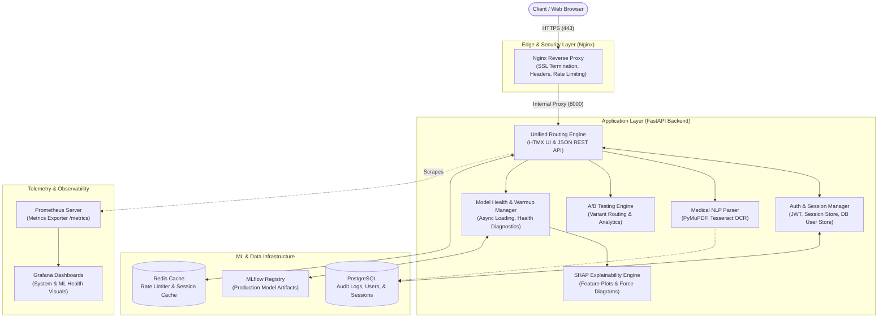

# Architecture Overview

```mermaid
flowchart TB
    User(["Client / Web Browser"])

    subgraph Edge ["Edge & Security Layer (Nginx)"]
        NginxProxy["Nginx Reverse Proxy\n(SSL Termination, Headers, Rate Limiting)"]
    end

    subgraph AppServer ["Application Layer (FastAPI Backend)"]
        Router["Unified Routing Engine\n(HTMX UI & JSON REST API)"]
        AuthService["Auth & Session Manager\n(JWT, Session Store, DB User Store)"]
        NLPService["Medical NLP Parser\n(PyMuPDF, Tesseract OCR)"]
        ABService["A/B Testing Engine\n(Variant Routing & Analytics)"]
        ModelMgr["Model Health & Warmup Manager\n(Async Loading, Health Diagnostics)"]
        ExplainService["SHAP Explainability Engine\n(Feature Plots & Force Diagrams)"]
    end

    subgraph DataML ["ML & Data Infrastructure"]
        MLflow["MLflow Registry\n(Production Model Artifacts)"]
        DB[(PostgreSQL\nAudit Logs, Users, & Sessions)]
        RedisCache[(Redis Cache\nRate Limiter & Session Cache)]
    end

    subgraph Mon ["Telemetry & Observability"]
        Prometheus["Prometheus Server\n(Metrics Exporter /metrics)"]
        Grafana["Grafana Dashboards\n(System & ML Health Visuals)"]
    end

    User -->|"HTTPS (443)"| NginxProxy
    NginxProxy -->|"Internal Proxy (8000)"| Router
    Router <--> AuthService
    Router --> NLPService
    Router --> ABService
    Router --> ModelMgr
    ModelMgr --> ExplainService
    AuthService <--> DB
    NLPService -.-> DB
    ModelMgr <--> MLflow
    Router <--> RedisCache
    Router -.->|"Scrapes"| Prometheus
    Prometheus --> Grafana
```
