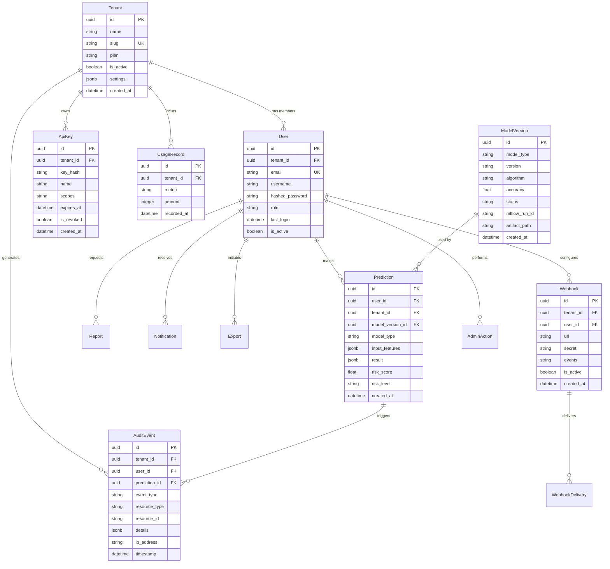

# Database Schema

```mermaid
erDiagram
    Tenant ||--o{ User : "has members"
    Tenant ||--o{ ApiKey : "owns"
    Tenant ||--o{ UsageRecord : "incurs"
    Tenant ||--o{ AuditEvent : "generates"
    User ||--o{ Prediction : "makes"
    User ||--o{ Report : "requests"
    User ||--o{ Notification : "receives"
    User ||--o{ Export : "initiates"
    User ||--o{ Webhook : "configures"
    User ||--o{ AdminAction : "performs"
    Prediction ||--o{ AuditEvent : "triggers"
    ModelVersion ||--o{ Prediction : "used by"
    Webhook ||--o{ WebhookDelivery : "delivers"

    Tenant {
        uuid id PK
        string name
        string slug UK
        string plan
        boolean is_active
        jsonb settings
        datetime created_at
    }

    User {
        uuid id PK
        uuid tenant_id FK
        string email UK
        string username
        string hashed_password
        string role
        datetime last_login
        boolean is_active
    }

    Prediction {
        uuid id PK
        uuid user_id FK
        uuid tenant_id FK
        uuid model_version_id FK
        string model_type
        jsonb input_features
        jsonb result
        float risk_score
        string risk_level
        datetime created_at
    }

    ApiKey {
        uuid id PK
        uuid tenant_id FK
        string key_hash
        string name
        string scopes
        datetime expires_at
        boolean is_revoked
        datetime created_at
    }

    AuditEvent {
        uuid id PK
        uuid tenant_id FK
        uuid user_id FK
        uuid prediction_id FK
        string event_type
        string resource_type
        string resource_id
        jsonb details
        string ip_address
        datetime timestamp
    }

    ModelVersion {
        uuid id PK
        string model_type
        string version
        string algorithm
        float accuracy
        string status
        string mlflow_run_id
        string artifact_path
        datetime created_at
    }

    Webhook {
        uuid id PK
        uuid tenant_id FK
        uuid user_id FK
        string url
        string secret
        string events
        boolean is_active
        datetime created_at
    }

    UsageRecord {
        uuid id PK
        uuid tenant_id FK
        string metric
        integer amount
        datetime recorded_at
    }
```
