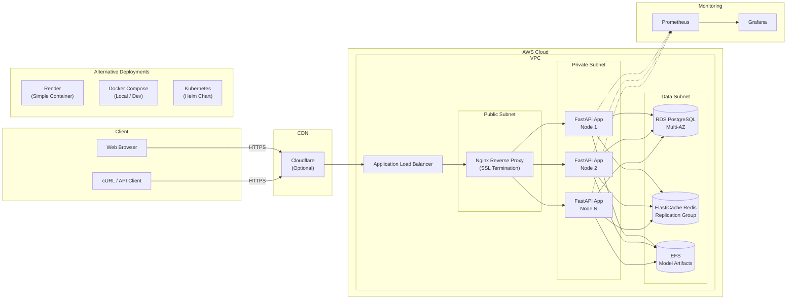

# Deployment Architecture

```mermaid
flowchart LR
    subgraph Client
        Browser["Web Browser"]
        CLI["cURL / API Client"]
    end

    subgraph CDN ["CDN"]
        Cloudflare["Cloudflare\n(Optional)"]
    end

    subgraph AWS ["AWS Cloud"]
        subgraph VPC ["VPC"]
            ALB["Application Load Balancer"]

            subgraph PublicSubnet ["Public Subnet"]
                Nginx["Nginx Reverse Proxy\n(SSL Termination)"]
            end

            subgraph PrivateSubnet ["Private Subnet"]
                App1["FastAPI App\nNode 1"]
                App2["FastAPI App\nNode 2"]
                App3["FastAPI App\nNode N"]
            end

            subgraph DataSubnet ["Data Subnet"]
                RDS[(RDS PostgreSQL\nMulti-AZ)]
                Redis[(ElastiCache Redis\nReplication Group)]
                EFS[(EFS\nModel Artifacts)]
            end
        end
    end

    subgraph Monitoring
        Prom["Prometheus"]
        Graf["Grafana"]
    end

    Browser -->|HTTPS| Cloudflare
    CLI -->|HTTPS| Cloudflare
    Cloudflare --> ALB
    ALB --> Nginx
    Nginx --> App1
    Nginx --> App2
    Nginx --> App3
    App1 --> RDS
    App2 --> RDS
    App3 --> RDS
    App1 --> Redis
    App2 --> Redis
    App3 --> Redis
    App1 --> EFS
    App2 --> EFS
    App3 --> EFS
    App1 -.-> Prom
    App2 -.-> Prom
    App3 -.-> Prom
    Prom --> Graf

    subgraph Alt ["Alternative Deployments"]
        Render["Render\n(Simple Container)"]
        DockerCompose["Docker Compose\n(Local / Dev)"]
        K8s["Kubernetes\n(Helm Chart)"]
    end
```
