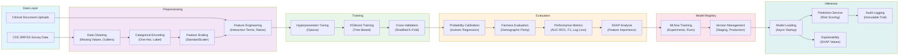

# ML Pipeline

```mermaid
flowchart LR
    subgraph Data["Data Layer"]
        BRFSS["CDC BRFSS Survey Data"]
        Clinical["Clinical Document Uploads"]
    end

    subgraph Prep["Preprocessing"]
        Clean["Data Cleaning\n(Missing Values, Outliers)"]
        Encode["Categorical Encoding\n(One-Hot, Label)"]
        Scale["Feature Scaling\n(StandardScaler)"]
        Engineer["Feature Engineering\n(Interaction Terms, Ratios)"]
    end

    subgraph Train["Training"]
        Optuna["Hyperparameter Tuning\n(Optuna)"]
        XGBoost["XGBoost Training\n(Tree-Based)"]
        CV["Cross-Validation\n(Stratified K-Fold)"]
    end

    subgraph Eval["Evaluation"]
        Calibrate["Probability Calibration\n(Isotonic Regression)"]
        Fairness["Fairness Evaluation\n(Demographic Parity)"]
        Metrics["Performance Metrics\n(AUC-ROC, F1, Log Loss)"]
        SHAP["SHAP Analysis\n(Feature Importance)"]
    end

    subgraph Registry["Model Registry"]
        MLflow["MLflow Tracking\n(Experiments, Runs)"]
        Versioning["Version Management\n(Staging, Production)"]
    end

    subgraph Inference["Inference"]
        Loading["Model Loading\n(Async Startup)"]
        Prediction["Prediction Service\n(Risk Scoring)"]
        Explain["Explainability\n(SHAP Values)"]
        Audit["Audit Logging\n(Immutable Trail)"]
    end

    BRFSS --> Clean
    Clinical --> Engineer
    Clean --> Encode
    Encode --> Scale
    Scale --> Engineer
    Engineer --> Optuna
    Optuna --> XGBoost
    XGBoost --> CV
    CV --> Calibrate
    Calibrate --> Fairness
    Fairness --> Metrics
    Metrics --> SHAP
    SHAP --> MLflow
    MLflow --> Versioning
    Versioning --> Loading
    Loading --> Prediction
    Loading --> Explain
    Prediction --> Audit

    style Data fill:#e1f5fe
    style Prep fill:#f3e5f5
    style Train fill:#e8f5e9
    style Eval fill:#fff3e0
    style Registry fill:#fce4ec
    style Inference fill:#e0f2f1
```
