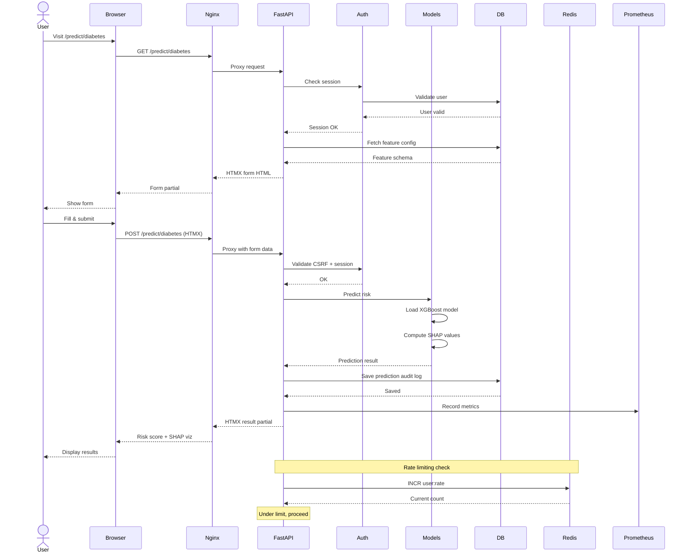

# System Flow

```mermaid
sequenceDiagram
    actor User
    participant Browser
    participant Nginx
    participant FastAPI
    participant Auth
    participant Models
    participant DB
    participant Redis
    participant Prometheus

    User->>Browser: Visit /predict/diabetes
    Browser->>Nginx: GET /predict/diabetes
    Nginx->>FastAPI: Proxy request
    FastAPI->>Auth: Check session
    Auth->>DB: Validate user
    DB-->>Auth: User valid
    Auth-->>FastAPI: Session OK
    FastAPI->>DB: Fetch feature config
    DB-->>FastAPI: Feature schema
    FastAPI-->>Nginx: HTMX form HTML
    Nginx-->>Browser: Form partial
    Browser-->>User: Show form

    User->>Browser: Fill & submit
    Browser->>Nginx: POST /predict/diabetes (HTMX)
    Nginx->>FastAPI: Proxy with form data
    FastAPI->>Auth: Validate CSRF + session
    Auth-->>FastAPI: OK
    FastAPI->>Models: Predict risk
    Models->>Models: Load XGBoost model
    Models->>Models: Compute SHAP values
    Models-->>FastAPI: Prediction result
    FastAPI->>DB: Save prediction audit log
    DB-->>FastAPI: Saved
    FastAPI->>Prometheus: Record metrics
    FastAPI-->>Nginx: HTMX result partial
    Nginx-->>Browser: Risk score + SHAP viz
    Browser-->>User: Display results

    Note over FastAPI,Redis: Rate limiting check
    FastAPI->>Redis: INCR user:rate
    Redis-->>FastAPI: Current count
    Note over FastAPI: Under limit, proceed
```
