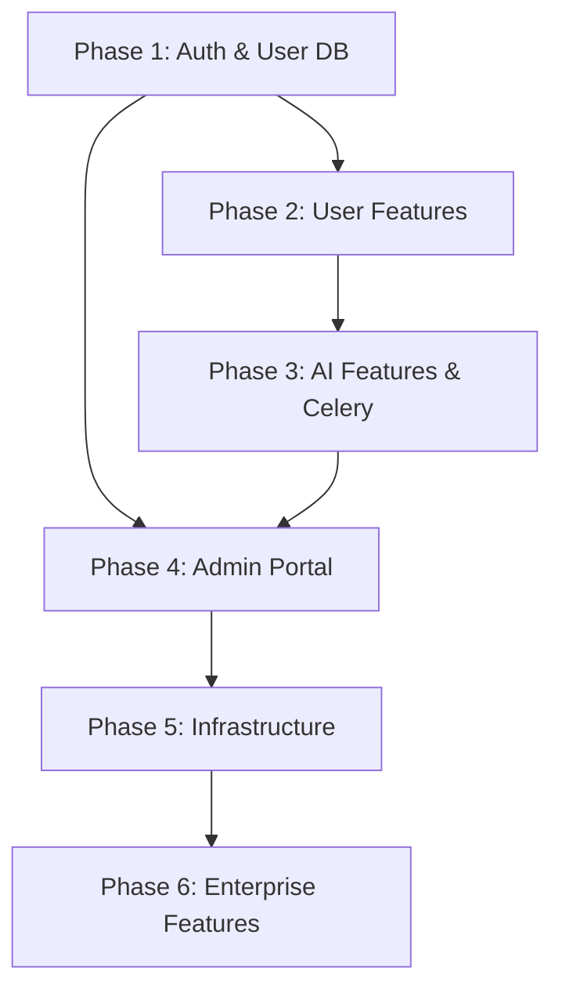

# Implementation Analysis: SaaS Transformation

## Current Architecture Summary
The HealthPredict AI platform is currently a unified FastAPI application serving both an HTMX-based web frontend and a JSON REST API. 
Key components include:
- **Core Backend**: FastAPI handling routing (`main.py`, `legacy_main.py`), with Pydantic for validation.
- **ML Layer**: Asynchronous model loading and warmup via `model_manager`. Live inference for Diabetes, Heart Disease, and Lung Cancer. SHAP explainability runs concurrently.
- **Data Stores**: Currently utilizes basic databases (likely SQLite for local/audit) based on `init_auth_db` and `ensure_audit_log_db` calls in the lifespan context. MLflow is used for model registries. Uses `InMemoryBackend` for cache.
- **Monitoring & Security**: Prometheus metrics are integrated. There is basic rate limiting and security headers middleware.

## Strengths
- **Solid Foundation**: FastAPI, Pydantic, and HTMX provide a fast, modern, and lightweight stack.
- **MLOps Readiness**: Models are already separated logically, loaded asynchronously, and tracked via MLflow.
- **Observability**: Prometheus metrics are already instrumented.
- **Security Posture**: Basic CORS, rate limiting, and trusted host middlewares exist.

## Weaknesses
- **Database & Persistence**: Lack of a robust, standardized ORM (SQLAlchemy 2.0) and migration tool (Alembic). Current DB operations seem fragmented (`init_auth_db`, `ensure_audit_log_db`).
- **Authentication**: Auth is currently basic/in-memory or SQLite-based. Lacks robust JWT rotation, comprehensive RBAC, and standardized user models.
- **Task Queues**: Heavy background tasks (like SHAP explainability) are run via `asyncio.to_thread` or basic background tasks, lacking a durable message queue like Celery.
- **Caching**: Currently using an in-memory cache backend instead of Redis for rate limiting and caching.

## Phase-by-Phase Implementation Strategy

### Phase 1: Authentication & User Management
- **Strategy**: Introduce PostgreSQL, SQLAlchemy 2.0 (async), and Alembic. Create core tables (`User`, `UserSession`, `AuditLog`, etc.). Implement robust JWT authentication with refresh token rotation and RBAC.
- **Impact**: Replaces existing `init_auth_db`. Requires updating dependencies.

### Phase 2: User Features
- **Strategy**: Build authenticated endpoints for prediction history, user profiles, and notifications. Use FastAPI `BackgroundTasks` for lightweight async work (emails, exports).
- **Impact**: Introduces user-specific data isolation (IDOR checks) and soft-deletion mechanisms.

### Phase 3: AI Features
- **Strategy**: Persist prediction inputs and SHAP values tied to `user_id`. Introduce Celery/RQ backed by Redis for heavy tasks (SHAP, PDF reports). Implement `ModelVersion` tracking in the database.
- **Impact**: Significant architectural addition (Celery Worker). Links ML workflows to user persistence.

### Phase 4: Admin Portal
- **Strategy**: Build admin endpoints utilizing DB-level aggregations for metrics. Add robust system health checks and an audit log viewer.
- **Impact**: Relies heavily on the `AuditLog` and `Prediction` tables built in Phases 1-3.

### Phase 5: Infrastructure
- **Strategy**: Formalize Docker Compose to include API, PostgreSQL, Redis, Celery, MLflow, and Nginx. Refine Prometheus metrics and Grafana dashboards.
- **Impact**: Transitions from local run scripts to standard containerized orchestration.

### Phase 6: Enterprise Features
- **Strategy**: Integrate S3/MinIO for report storage. Add API keys, webhooks with HMAC, and backup runbooks.
- **Impact**: Final polish for enterprise readiness and developer integration.

## Dependency Graph

## Risks and Open Questions
1. **Database Migration Strategy**: Moving from the current fragmented SQLite/in-memory state to PostgreSQL. *Risk*: Existing local data might be lost or require a specific one-time migration script if data preservation is needed.
2. **HTMX Frontend Compatibility**: As API endpoints evolve (especially returning structured JSON errors or requiring JWT in headers/cookies), the HTMX frontend templates must be updated synchronously to avoid breaking the UI.
3. **Local Development Experience**: Introducing PostgreSQL and Redis early (Phase 1/3) means developers must use Docker Compose or have local daemons running. *Question*: Should we support SQLite for local dev via SQLAlchemy, or enforce PostgreSQL via Docker for consistency?
4. **Legacy Endpoints**: `legacy_main.py` exists. Do we preserve legacy endpoints exactly as they are, or deprecate them during these phases?
