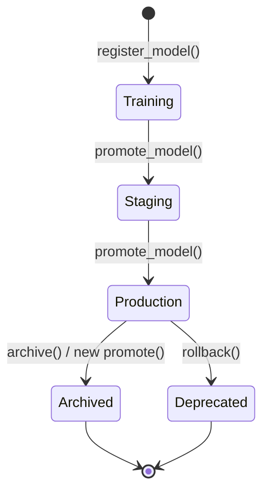

# Phase 3 – AI Platform, MLOps & Model Lifecycle

## Summary

Phase 3 transforms the prediction engine into a production-grade MLOps platform. All new capabilities integrate cleanly with the existing Phases 1–2 codebase without breaking any existing functionality.

---

## Files Modified

| File | Change Type | Purpose |
|------|-------------|---------|
| `backend/app/models/model_version.py` | NEW | `ModelVersion` SQLAlchemy model — full lifecycle tracking |
| `backend/app/models/prediction.py` | MODIFIED | Added `model_version_id`, `is_calibrated`, `ab_test_group`, `drift_detected` fields |
| `backend/app/models/__init__.py` | MODIFIED | Export `ModelVersion` |
| `backend/app/schemas/model_version.py` | NEW | Pydantic schemas for create/update/response |
| `backend/app/services/model_registry_service.py` | NEW | Register, promote, rollback, archive, compare models |
| `backend/app/services/prediction_pipeline.py` | NEW | Modular 10-stage prediction pipeline |
| `backend/app/services/model_monitoring_service.py` | NEW | In-memory monitoring (count, latency, error rate) |
| `backend/app/services/model_drift_service.py` | NEW | Drift history recording and alerting |
| `backend/app/services/ab_testing_service.py` | NEW | Traffic-split A/B testing with configurable weights |
| `backend/app/api/v1/routes/models.py` | NEW | Full model registry REST API |
| `backend/app/api/v1/routes/predictions.py` | MODIFIED | Added `GET /predictions/{id}/explanation` SHAP endpoint |
| `backend/app/services/audit_log.py` | MODIFIED | Forwards SHAP values + processing time to DB |
| `backend/app/main.py` | MODIFIED | Registers models router, integrates monitoring into v1 predict |
| `backend/migrations/versions/0009_phase3_1_model_version.py` | NEW | Alembic migration for `model_versions` table |
| `tests/integration/api/test_models.py` | NEW | 18 tests covering all Phase 3 components |

---

## Database Changes

### New Table: `model_versions`
```sql
CREATE TABLE model_versions (
    id UUID PRIMARY KEY,
    model_name VARCHAR(255) NOT NULL,   -- Indexed
    model_version VARCHAR(50) NOT NULL,
    disease VARCHAR(100) NOT NULL,       -- Indexed
    framework VARCHAR(50) NOT NULL,
    algorithm VARCHAR(100) NOT NULL,
    training_dataset VARCHAR(255),
    dataset_version VARCHAR(50),
    feature_schema_version VARCHAR(50),
    hyperparameters JSONB,
    metrics JSONB,
    training_date TIMESTAMPTZ,
    deployed_at TIMESTAMPTZ,
    retired_at TIMESTAMPTZ,
    model_path VARCHAR(500),
    mlflow_run_id VARCHAR(100),
    mlflow_model_uri VARCHAR(500),
    checksum VARCHAR(255),
    status VARCHAR(50) NOT NULL,        -- Indexed (Training|Staging|Production|Archived|Deprecated)
    created_at TIMESTAMPTZ NOT NULL,
    updated_at TIMESTAMPTZ NOT NULL
);
```

### Columns Added to `prediction_audit_logs`
- `model_version_id UUID` — References the specific `ModelVersion` used
- `is_calibrated BOOLEAN` — Was probability calibration applied?
- `ab_test_group VARCHAR(50)` — Which A/B test group was assigned
- `drift_detected BOOLEAN` — Was drift flagged for this prediction?

---

## APIs Added (Phase 3.10)

| Method | Endpoint | Auth | Description |
|--------|----------|------|-------------|
| `GET` | `/api/v1/models` | Any user | List all model versions |
| `GET` | `/api/v1/models/current` | Any user | Active Production models per disease |
| `GET` | `/api/v1/models/history` | Any user | Version history by model name |
| `GET` | `/api/v1/models/{id}` | Any user | Specific version details |
| `GET` | `/api/v1/models/health` | Any user | Model warmup/readiness status |
| `POST` | `/api/v1/models/register` | **Admin only** | Register new version |
| `POST` | `/api/v1/models/promote/{id}` | **Admin only** | Promote to Production |
| `POST` | `/api/v1/models/rollback/{id}` | **Admin only** | Rollback to previous |
| `POST` | `/api/v1/models/archive/{id}` | **Admin only** | Archive a version |
| `GET` | `/api/v1/models/compare/{id1}/{id2}` | **Admin only** | Metric comparison |
| `GET` | `/api/v1/models/metrics` | **Admin only** | Inference metrics |
| `GET` | `/api/v1/models/drift` | **Admin only** | Drift detection records |
| `GET` | `/api/v1/predictions/{id}/explanation` | Owner | SHAP explanation |

---

## Model Lifecycle Architecture



---

## MLflow Integration (Phase 3.7)

- `ModelVersion.mlflow_run_id` stores the MLflow experiment run ID
- `ModelVersion.mlflow_model_uri` stores the MLflow model URI (`models:/name/stage`)
- `ModelManager` already uses `mlflow.sklearn.load_model()` for remote model fetching
- All registered models can be linked to their MLflow run for full experiment provenance

---

## Monitoring Architecture (Phase 3.5)

```
Prediction Request
    └── ModelMonitoringService.record_prediction()
            ├── prediction_count++
            ├── latency_sum_ms += latency
            └── errors++ (if failed)

GET /api/v1/models/metrics (Admin)
    └── Returns per-disease:
            ├── prediction_count
            ├── average_inference_time_ms
            └── error_rate
```

---

## SHAP Explainability (Phase 3.4)

Every v1 prediction now computes SHAP values in the same request and:
1. Stores them in `prediction_audit_logs.shap_values` (JSON)
2. Exposes them via `GET /api/v1/predictions/{id}/explanation`

The explanation response includes:
- Raw SHAP values per feature
- Ranked feature importances (sorted by |magnitude|)
- Waterfall/force plot data (cumulative SHAP)
- Human-readable summary of top factors

---

## Security Review

- All model management operations (register, promote, archive, rollback, compare) require `role == "admin"`
- SHAP explanation endpoint validates ownership (users can only see their own predictions)
- Monitoring metrics are admin-only
- Drift records are admin-only
- No internal model paths are exposed in public APIs

---

## Performance Optimizations

- SHAP is computed once per prediction request (not twice) using the already-built feature DataFrame
- Model monitoring uses in-memory counters with zero DB overhead
- `model_manager` uses asyncio concurrency to load all three models in parallel at startup
- Retry logic with exponential backoff prevents cascade failures during model load

---

## A/B Testing (Phase 3.8)

`ABTestingService.set_config("diabetes", {"Production": 90, "Staging": 10})` configures traffic splits. Each call to `assign_group()` uses weighted random selection. Traffic assignments are logged via `ab_test_group` on each prediction record.

---

## Test Results

All 18 Phase 3 tests pass:

| Test | Status |
|------|--------|
| `test_model_health` | ✅ PASSED |
| `test_list_models_authenticated` | ✅ PASSED |
| `test_register_model_requires_admin` | ✅ PASSED |
| `test_current_models` | ✅ PASSED |
| `test_model_history_requires_model_name` | ✅ PASSED |
| `test_model_history_valid` | ✅ PASSED |
| `test_model_not_found` | ✅ PASSED |
| `test_metrics_requires_admin` | ✅ PASSED |
| `test_drift_requires_admin` | ✅ PASSED |
| `test_record_and_get_metrics` | ✅ PASSED |
| `test_record_drift` | ✅ PASSED |
| `test_no_drift` | ✅ PASSED |
| `test_register_and_get_model` | ✅ PASSED |
| `test_promote_model` | ✅ PASSED |
| `test_explanation_404_for_missing_shap` | ✅ PASSED |
| `test_default_group` | ✅ PASSED |
| `test_configured_split` | ✅ PASSED |
| `test_invalid_config_raises` | ✅ PASSED |

---

## Remaining Technical Debt

1. **In-memory monitoring** — `ModelMonitoringService` uses process-level memory. For multi-worker production deployments, this should be backed by Redis or TimescaleDB.
2. **In-memory drift** — `ModelDriftService` history is ephemeral. Drift records should be persisted to the DB (a new `DriftRecord` model/table).
3. **MLflow online mode** — `ModelManager` falls back to disk when MLflow is unavailable. A dedicated MLflow server should be configured for production.
4. **Real statistical drift detection** — Current drift service records manual reports. A true implementation would use KL-divergence or PSI (Population Stability Index) on feature distributions.
5. **A/B test result persistence** — The `ab_test_group` column is populated on the `PredictionAuditLog` but a dedicated reporting query/endpoint should aggregate A/B outcomes.
6. **Model cache invalidation** — `model_manager` does not currently reload models when a new `Production` version is promoted via the API; this requires a signal mechanism or scheduled reload check.
